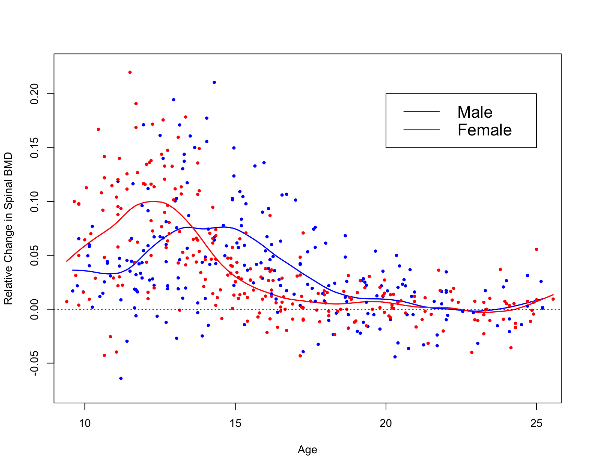

```{r, include=FALSE}
#load packages for workflow
library(mgcv)
library(splines)
library(dplyr)
library(gam)
library(ggplot2)
```

\newpage
## Question #1

Here we replicate Figure 5.6 from ESL.

\tiny
```{r, eval=FALSE}
#download dataset
url <- "https://hastie.su.domains/ElemStatLearn/datasets/bone.data"
dd_bmd <- read.delim(url)

#create male and female datasets
males <- dd_bmd %>% filter(gender == "male") %>% select(age, spnbmd)
females <- dd_bmd %>% filter(gender == "female") %>% select(age, spnbmd)

#smooth splines
males_spline <- smooth.spline(x = males$age, y = males$spnbmd, df = 12)
females_spline <- smooth.spline(x = females$age, y = females$spnbmd, df = 12)

#code to generate figure
plot(males_spline,ylim=c(-0.075,0.225),col="blue",type="l",
     lwd=1.75,xlab="",ylab="")
lines(females_spline,col="red",lwd=1.75)
points(x=males$age,y=males$spnbmd,col="blue",pch=20,lwd=0.001)
points(x=females$age,y=females$spnbmd,col="red",pch=20,lwd=0.001)
abline(h=0,lty=3)
title(xlab="Age",ylab="Relative Change in Spinal BMD")
legend(x=c(20,25),y=c(0.15,0.20),legend=c("Male","Female"),
       col=c("blue","red"),lty=1,cex=1.5)
```
\normalsize

```{r,out.height='100%', out.width='100%', echo=FALSE}

```

\newpage
## Question #2

Here we compute a logistic regression model using the b-spline, natural spline and truncated power basis functions.

Custom knots were defined prior to fitting each model as the splines package defaults would produce NA values in the covariance matrix. Further, for the truncated power basis, the left knot was moved to $0.30$ as NA values appeared again in the covariance matrix.

\tiny
```{r}
#download dataset (borrowed from class notes)
url <- "http://www-stat.stanford.edu/~tibs/ElemStatLearn/datasets/SAheart.data"
fn <- "SAheart.txt"
if (!file.exists(fn)) download.file(url, destfile = fn)
raw_dd <- read.csv(fn, row.names = 1)
dd <- raw_dd %>% select(tobacco, chd)

#b-spline basis
b_spline_fit <- gam(chd ~ bs(x = tobacco, knots = quantile(tobacco, seq(0.25,0.85,length=5))), family = binomial, data = dd)
b_spline_X <- model.matrix(b_spline_fit)
vcov_b <- vcov(b_spline_fit)

#natural spline basis
natural_spline_fit <- gam(chd ~ ns(x = tobacco, knots = quantile(tobacco, seq(0.25,0.85,length=5))), family = binomial, data = dd)
natural_spline_X <- model.matrix(natural_spline_fit)
vcov_natural <- vcov(natural_spline_fit)

#truncated power basis
q2 <- function(x, nknots) {
  knots <- quantile(x, seq(0.30, 0.85, length = nknots))
  trunc_fun <- function(k) (x>k)*(x-k)^3
  s <- sapply(knots, trunc_fun)
  s <- cbind(x, x^2, x^3, s)
  return(s)
}

truncated_fit <- gam(chd ~ q2(x = tobacco, nknots = 5), family = binomial, data = dd)
truncated_X <- model.matrix(truncated_fit)
vcov_truncated <- vcov(truncated_fit)

```
\normalsize

\newpage
Plots of the model predictions +/- one standard error on log-odds scale.

\tiny
```{r}
#b-spline basis
b_spline_se <- b_spline_X %*% vcov_b %*% t(b_spline_X)
b_spline_se <- sqrt(diag(b_spline_se))
b_spline_plot <- data.frame(tobacco = dd$tobacco,
                                  fitted = b_spline_X %*% coef(b_spline_fit),
                                  se = b_spline_se)

ggplot(b_spline_plot, aes(x = tobacco, y = fitted)) +
  geom_line() +
  geom_point() +
  geom_ribbon(aes(ymin = fitted - se, ymax = fitted + se), alpha = 0.1) +
  labs(title = "B-Spline Basis")
```
\normalsize

\newpage
\tiny
```{r}
#natural spline basis
natural_spline_se <- natural_spline_X %*% vcov_natural %*% t(natural_spline_X)
natural_spline_se <- sqrt(diag(natural_spline_se))
natural_spline_plot <- data.frame(tobacco = dd$tobacco,
                                  fitted = natural_spline_X %*% coef(natural_spline_fit),
                                  se = natural_spline_se)

ggplot(natural_spline_plot, aes(x = tobacco, y = fitted)) +
  geom_line() +
  geom_point() +
  geom_ribbon(aes(ymin = fitted - se, ymax = fitted + se), alpha = 0.1) +
  labs(title = "Natural Spline Basis")
```
\normalsize

\newpage
\tiny
```{r}
#truncated power basis
truncated_se <- truncated_X %*% vcov_truncated %*% t(truncated_X)
truncated_se <- sqrt(diag(truncated_se))
truncated_plot <- data.frame(tobacco = dd$tobacco,
                                  fitted = truncated_X %*% coef(truncated_fit),
                                  se = truncated_se)

ggplot(truncated_plot, aes(x = tobacco, y = fitted)) +
  geom_line() +
  geom_point() +
  geom_ribbon(aes(ymin = fitted - se, ymax = fitted + se), alpha = 0.1) +
  labs(title = "Truncated Power Basis")
```
\normalsize

\newpage
## Question #3

Below we create a function that implements the truncated power basis and natural spline basis.

\tiny
```{r}
truncpolyspline <- function(x, df, natural = c(TRUE, FALSE)) {
  if (!require("Matrix")) stop("need Matrix package")

  #truncated power basis
  if(!natural) {
    knots <- quantile(x, seq(0, 1, length = df-1))
    trunc_fun <- function(k) (x>=k)*(x-k)^3
    s <- sapply(knots[1:(df-2)], trunc_fun)
    s <- cbind(x, x^2, s)
    return(s)
  }
  
  #natural spline basis
  if(natural) {
    knots <- quantile(x, seq(0, 1, length = df-1))
    
    trunc_fun <- function(k, K) ((x>=k)*(x-k)^3 - (x>=K)*(x-K)^3)/(K-k)
    
    K <- as.numeric(knots[length(knots)])
    K_1 <- as.numeric(knots[length(knots)-1])
    
    d_K_1 <- ((x>=K_1)*(x-K_1)^3 - (x>=K)*(x-K)^3)/(K-K_1)
    
    s <- sapply(knots[1:(df-2)],trunc_fun,K=K)
    s <- cbind(1,x,s)
    return(s)
  }
}
```
\normalsize

\newpage
\tiny
```{r}
xvec <- seq(0, 1, length = 101)
tS_natural <- truncpolyspline(xvec, df = 5, natural = TRUE)
matplot(scale(tS_natural), type = "l", ylab = "Natural Basis")
```
\normalsize

\newpage
\tiny
```{r}
tS_power <- truncpolyspline(xvec, df = 5, natural = FALSE)
matplot(scale(tS_power), type = "l", ylab = "Truncated Basis")
```
\normalsize

\newpage
## Question #4

a) Here we simulate data from the two-dimensional surface $f(x,y) = \exp((x-\tfrac{1}{2})^2 + (y-\tfrac{1}{2})^2)$ with points drawn uniform at random on the x and y axis.

\tiny
```{r}
sim_values <- function(c1 = 1/2, c2 = 1/2) {
  x <- runif(1)
  y <- runif(1)
  f <- exp((x-c1)^2+(y-c2)^2) + rnorm(1)
  return(list(x,y,f))
}

df <- data.frame(x=rep(0, 250), y=rep(0, 250), z=rep(0, 250))
for (i in 1:250) df[i,] <- df[i,] + sim_values()

```
\normalsize

b) Use mgcv::gam() to fit two-dimensional splines to your simulated data, using z ~ te(gp, x, y). Over an ensemble of 250 simulations, compute the average computation time, bias, variance, and mean-squared error of your predictions for (i) method = "GCV.Cp" (generalized cross-validation) and (ii) method = "REML" (restricted maximum likelihood).

\tiny
```{r}
mgcv::gam(z ~ te(x,y), data = df, method = "GCV.Cp")
mgcv::gam(z ~ te(x,y), data = df, method = "REML")
```
\normalsize

\newpage
## Question #5 (ESL 5.4)

Consider the truncated power series representation for cubic splines with K interior knots:

$$f(X)= \sum^{3}_{j=0} \beta_jX^j + \sum^{K}_{k=1} \theta_k (X-\xi_k)^3_+$$
The natural boundary conditions say that outside the boundary knots, the function must be linear. For $X < \xi_1$, we have $\sum^{K}_{k=1} \theta_k (X-\xi_k)^3_+ = 0$ and $f(X) = \sum^{3}_{j=0} \beta_jX^j = \beta_0 + \beta_1X+\beta_2X^2+\beta_3X^3$. For this function to be linear when $X < \xi_1$, we have $\beta_2=\beta_3=0$. Similarly for $X \ge \xi_k$, we have $f(X)= \sum^{3}_{j=0} \beta_jX^j + \sum^{K}_{k=1} \theta_k (X-\xi_k)^3_+$. Expanding the second term we have $(X-\xi_k)^3_+ = X^3 - 3\xi_k X^2 + 3 \xi_k^2 X - \xi_k^3$. 

We can re-write $f(X)$ in the following way:

```{=latex}
\begin{align}
f(X) &= \sum^{3}_{j=0} \beta_jX^j + \sum^{K}_{k=1} \theta_k (X-\xi_k)^3_+\\
&=\sum^{3}_{j=0} \beta_jX^j  + \sum^{K}_{k=1} \theta_k [X^3 - 3\xi_k X^2 + 3 \xi_k^2 X - \xi_k^3]\\
&= \beta_0 + \beta_1X+\beta_2X^2+\beta_3X^3 + \sum^{K}_{k=1} \theta_k X^3 - 3 \sum^{K}_{k=1} \theta_k \xi_k X^2 + 3 \sum^{K}_{k=1} \theta_k \xi_k^2 X - \sum^{K}_{k=1} \theta_k \xi_k^3\\
&= \beta_0 + \beta_1 X + \beta_2 X^2+ \beta_3 X^3 + \sum^{K}_{k=1} \theta_k X^3 - 3 \sum^{K}_{k=1} \theta_k \xi_k X^2 + 3 \sum^{K}_{k=1} \theta_k \xi_k^2 X - \sum^{K}_{k=1} \theta_k \xi_k^3\\
&= \beta_0 - \sum^{K}_{k=1} \theta_k \xi_k^3 + X (\beta_1 + 3 \sum^{K}_{k=1} \theta_k \xi_k^2) + X^2 (\beta_2 - 3 \sum^{K}_{k=1} \theta_k \xi_k) + X^3 (\beta_3  + \sum^{K}_{k=1} \theta_k)
\end{align}
```

For this function to be linear, we require $\beta_2 - 3 \sum^{K}_{k=1} \theta_k\xi_k=0$ and $\beta_3  + \sum^{K}_{k=1} \theta_k=0$. Further, we have $\beta_2 = \beta_3 = 0$, which implies $\sum^{K}_{k=1} \theta_k\xi_k=0$ and $\sum^{K}_{k=1} \theta_k=0$ as required.

The natural cubic spline basis is of the form $N_1(X)=1$, $N_2(X)=X$ and $N_{k+2}(X)=d_k(X)-d_{K-1}(X)$ where $d_k(X)=\tfrac{(X-\xi_k)^3_+ - (X-\xi_K)^3_+}{\xi_K - \xi_k}$. To derive this basis from the truncated power series representation, we show that $f(X)$ can be written as a linear combination of the $N_k(X)$ basis functions such that $f(X) = \sum^K_{k=1} \alpha_k N_k(X)$.

For $X < \xi_1$, we have $N_{k+2}(X) = d_k(X)-d_{K-1}(X) = 0$ for all $k > 2$ which means $$f(X) = \sum^K_{k=1} \alpha_k N_k(X)=\alpha_1 N_1(X) + \alpha_2 N_2(X)=\alpha_1 + \alpha_2 X$$

Thus, we have $\alpha_1=\beta_0$ and $\alpha_2=\beta_1$.

For $X \ge \xi_K$ and $K-2 \ge k$, we have the following:

```{=latex}
\begin{align}
N_{k+2}(X) &= d_k(X)-d_{K-1}(X)\\
&= \tfrac{(X-\xi_k)^3_+ - (X-\xi_K)^3_+}{\xi_K - \xi_k} - \tfrac{(X-\xi_{K-1})^3_+ - (X-\xi_K)^3_+}{\xi_K - \xi_{K-1}}\\
&= \tfrac{X^3 - 3\xi_k X^2 + 3 \xi_k^2 X - \xi_k^3 - X^3 + 3\xi_K X^2 - 3 \xi_K^2 X + \xi_K^3}{\xi_K - \xi_k} - \tfrac{X^3 - 3\xi_{K-1} X^2 + 3 \xi_{K-1}^2 X - \xi_{K-1}^3 - X^3 + 3\xi_K X^2 - 3 \xi_K^2 X + \xi_K^3}{\xi_K - \xi_{K-1}}\\
&= \tfrac{(- 3\xi_k + 3\xi_K) X^2 + (3 \xi_k^2 - 3 \xi_K^2 ) X + (\xi_K^3 - \xi_k^3)}{\xi_K - \xi_k} - \tfrac{(-3\xi_{K-1} + 3\xi_K) X^2 + (3\xi_{K-1}^2 - 3 \xi_K^2) X + (\xi_K^3 - \xi_{K-1}^3)}{\xi_K - \xi_{K-1}}\\
&= \tfrac{3(\xi_K - \xi_k) X^2 + 3 (\xi_k^2 - \xi_K^2 ) X + (\xi_K^3 - \xi_k^3)}{\xi_K - \xi_k} - \tfrac{3 (\xi_K -\xi_{K-1}) X^2 + 3(\xi_{K-1}^2 - \xi_K^2) X + (\xi_K^3 - \xi_{K-1}^3)}{\xi_K - \xi_{K-1}}\\
&= 3X^2 - 3 X^2 + \tfrac{3 (\xi_k^2 - \xi_K^2 ) X + (\xi_K^3 - \xi_k^3)}{\xi_K - \xi_k} - \tfrac{3(\xi_{K-1}^2 - \xi_K^2) X + (\xi_K^3 - \xi_{K-1}^3)}{\xi_K - \xi_{K-1}}\\
&= \tfrac{3 (\xi_k + \xi_K)(\xi_k - \xi_K) X + (\xi_K - \xi_k)(\xi_K^2 +  2\xi_K \xi_k + \xi_k^2)}{\xi_K - \xi_k} - \tfrac{3(\xi_{K-1} + \xi_K)(\xi_{K-1} - \xi_K) X + (\xi_K - \xi_{K-1})(\xi_K^2 + 2\xi_K \xi_{K-1} + \xi_{K-1}^2)}{\xi_K - \xi_{K-1}}\\
&= \tfrac{-3 (\xi_k + \xi_K)(\xi_K - \xi_k) X}{\xi_K - \xi_k}  + \tfrac{(\xi_K - \xi_k)(\xi_K^2 +  2\xi_K \xi_k + \xi_k^2)}{\xi_K - \xi_k} + \tfrac{3(\xi_{K-1} + \xi_K)(\xi_K - \xi_{K-1}) X}{\xi_K - \xi_{K-1}} - \tfrac{(\xi_K - \xi_{K-1})(\xi_K^2 + 2\xi_K \xi_{K-1} + \xi_{K-1}^2)}{\xi_K - \xi_{K-1}}\\
&= -3 (\xi_k + \xi_K)X  + (\xi_K^2 +  2\xi_K \xi_k + \xi_k^2) + 3(\xi_{K-1} + \xi_K) X - (\xi_K^2 + 2\xi_K \xi_{K-1} + \xi_{K-1}^2)\\
&= (2\xi_K \xi_k + \xi_k^2 - 2\xi_K \xi_{K-1} - \xi_{K-1}^2) + 3((\xi_{K-1} + \xi_K) - (\xi_k + \xi_K)) X \\
&= b + m X
\end{align}
```

This shows that $f(X)$ is linear past the last boundary knot as required.

\newpage
Before showing the recursion relation holds for the basis, we need two identities. The first identity is from the first section of the proof:

```{=latex}
\begin{align}
\sum^{K}_{k=1} \theta_k &= 0 \\
\implies \sum^{K-1}_{k=1} \theta_k &= -\theta_K \\
\implies \sum^{K-2}_{k=1} \theta_k &= -\theta_K - \theta_{K-1}
\end{align}
```

The second identity follows in the same way:

```{=latex}
\begin{align}
\sum^{K}_{k=1} \xi_k \theta_k &= 0 \\
\implies \sum^{K-2}_{k=1} \xi_k \theta_k &= -\xi_{K} \theta_{K} - \xi_{K-1} \theta_{K-1}
\end{align}
```

\newpage
## Question #6 (ESL 5.13)

Suppose we fit the smoothing spline $\hat{f}_\lambda = S_\lambda y$ where $S_\lambda = N(N^TN+\lambda\Omega_N)^{-1}N^T$. We will use the notation $\hat{f}^{(-i)}(x)$ to denote the prediction made at $x_i$ using a smoothing spline fitted to data that excludes the $i^{th}$ observation. When performing LOOCV, we remove each point and re-fit the model. In vector notation, we can write this out as $y'= y + (\hat{f}^{(-i)}_\lambda(x_i) - y_i) e_i$, where $y$ is the original vector of responses. The vector $e_i$ is the standard basis vector in $\mathbb{R}^N$, and in this representation we replace the $i^{th}$ observation of $y$ with the predicted value $\hat{f}^{(-i)}_\lambda(x_i)$. The fitted values for the response vector $y'$ are:

```{=latex}
\begin{align}
\hat{f}_\lambda^{(-i)} &= S_\lambda y' \\
&= S_\lambda (y + (\hat{f}^{(-i)}_\lambda(x_i) - y_i) e_i)\\
&= S_\lambda y + S_\lambda (\hat{f}^{(-i)}_\lambda(x_i) - y_i) e_i\\
&= \hat{f}_\lambda + S_\lambda (\hat{f}^{(-i)}_\lambda(x_i) - y_i) e_i
\end{align}
```

The term $S_\lambda y$ is equal to fitting the spline using all of the data, which is just $\hat{f}_\lambda$ from above. To get the coordinate for $x_i$, we can take the dot product with $e_i^T$ as follows:

```{=latex}
\begin{align}
e_i^T \hat{f}_\lambda^{(-i)} &= e_i^T \hat{f}_\lambda + e_i^T S_\lambda (\hat{f}^{(-i)}(x_i) - y_i) e_i\\
\hat{f}_\lambda^{(-i)}(x_i) &= \hat{f}_\lambda(x_i) + (\hat{f}^{(-i)}(x_i) - y_i) e_i^T S_\lambda e_i\\
\hat{f}_\lambda^{(-i)}(x_i) &= \hat{f}_\lambda(x_i) +  (\hat{f}^{(-i)}(x_i) - y_i) S_\lambda(i,i)
\end{align}
```

 We have $e_i^T \hat{f}_\lambda^{(-i)} = \hat{f}_\lambda^{(-i)}(x_i)$ since we are picking out the $i^{th}$ coordinate of the fitted values for $y'$. Further, $e_i^T \hat{f}_\lambda = \hat{f}_\lambda(x_i)$, which is the predicted value for $x_i$ from the full model. Note that the term $(\hat{f}^{(-i)}(x_i) - y_i)$ is a scalar and the term $S_\lambda(i,i) = e_i^T S_\lambda e_i$ denotes the $i^{th}$ row and column of the smoothing matrix.
 
 To get the form of equation (5.26), we multiply both sides by $-1$ and add $y_i$ to both sides:
 
```{=latex}
\begin{align}
y_i - \hat{f}_\lambda^{(-i)}(x_i) &= y_i - \hat{f}_\lambda(x_i) -  (\hat{f}^{(-i)}(x_i) - y_i) S_\lambda(i,i)\\
y_i - \hat{f}_\lambda^{(-i)}(x_i) + (\hat{f}^{(-i)}(x_i) - y_i) S_\lambda(i,i) &= y_i - \hat{f}_\lambda(x_i)\\
y_i - \hat{f}_\lambda^{(-i)}(x_i) + \hat{f}^{(-i)}(x_i) S_\lambda(i,i) - y_i S_\lambda(i,i) &= y_i - \hat{f}_\lambda(x_i)\\
y_i (1 - S_\lambda(i,i)) + \hat{f}_\lambda^{(-i)}(x_i) (S_\lambda(i,i) - 1) &= y_i - \hat{f}_\lambda(x_i)\\
(1 - S_\lambda(i,i)) (y_i - \hat{f}_\lambda^{(-i)}(x_i)) &= y_i - \hat{f}_\lambda(x_i)\\
y_i - \hat{f}_\lambda^{(-i)}(x_i) &= \frac{y_i - \hat{f}_\lambda(x_i)}{1 - S_\lambda(i,i)}
\end{align}
```

Thus, we have the N-fold cross validation formula as follows:

```{=latex}
\begin{align}
CV(\hat{f}_\lambda) &= \frac{1}{N} \sum_{i=1}^{N} (y_i - \hat{f}_\lambda^{(-i)}(x_i))^2\\
&= \frac{1}{N} \sum_{i=1}^{N} (\frac{y_i - \hat{f}_\lambda(x_i)}{1 - S_\lambda(i,i)})^2
\end{align}
```
