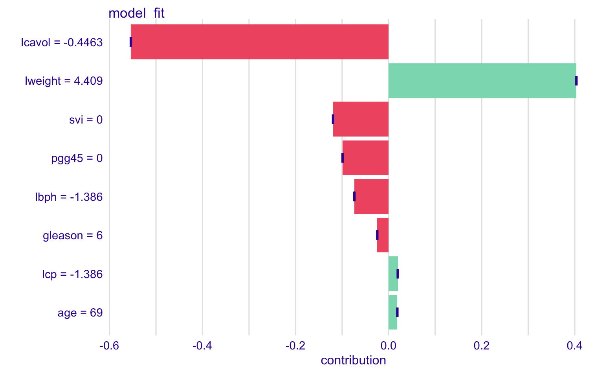
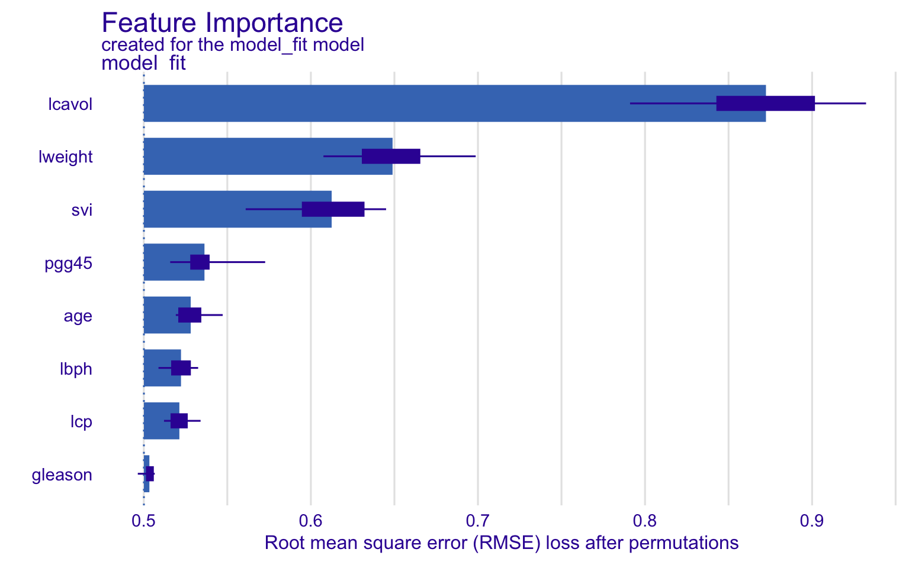

```{r, include=FALSE, message=FALSE, warning=FALSE}
library(ggplot2)
library(tidymodels)
library(tidyverse)
library(GGally)
library(DALEXtra)
```

\newpage

## Question #1

The prostate cancer dataset, introduced on page 3 of ESL, comes from a 1989 paper on diagnosis of adenocarcinoma in the prostate [here](https://pubmed.ncbi.nlm.nih.gov/2468795/). There are 97 observations, 8 predictor variables and one response variable, lpsa. A detailed description of each variable can be found below (taken from [here](https://rdrr.io/cran/ElemStatLearn/man/prostate.html)). Some of this workflow, specifically the model tuning, comes from an R-blogger post by Selcuk Disci linked [here](https://www.r-bloggers.com/2022/12/the-effect-of-childhood-education-on-wealth-modeling-with-bayesian-additive-regression-trees-bart/).

|                   |                                                             |
|:-------------------------|:---------------------------------------------|
| **Variable**      | **Description**                                             |
| lcavol            | log cancer volume                                           |
| lweight           | log prostate weight                                         |
| age               | patient age in years                                        |
| lbph              | log of the amount of benign prostatic hyperplasia           |
| svi               | seminal vesicle invasion                                    |
| lcp               | log of capsular penetration                                 |
| gleason           | Gleason score of how easily glands are identified in tissue |
| pgg45             | percent of Gleason score 4 or 5                             |
| lpsa (response\*) | log prostate specific antigen                               |

We download the prostate cancer dataset from the ESL website. The predictors are all numeric, so we scale them to have mean zero and unit variance prior to fitting our tree model (in our recipe). Since we have few variables and no categorical data, the data processing step is straightforward.

```{r}
url <- "https://hastie.su.domains/ElemStatLearn/datasets/prostate.data"
df_prostate <- read.table(file = url, 
                          sep = "\t",
                          header = TRUE) %>% 
  select(-X, -train) %>%
  as_tibble()

df_prostate_scaled <- df_prostate
df_prostate_scaled[1:8] <- scale(df_prostate_scaled[1:8], TRUE, TRUE)
```

Using GGally, we created a pairs plot. From the resulting plot, we see some variables like lcavol and svi are highly correlated with the response variable lpsa. There is high correlation between some predictiors like lcavol and lcp.

```{r, message=FALSE, echo=FALSE}
GGally::ggpairs(df_prostate_scaled, 
        lower = list(continuous = wrap("points", alpha = 0.1, size = 0.1), 
                             combo ="facethist", 
                             discrete = "facetbar", 
                             na =  "na"))
```

Most patients in this dataset are older than $60$, and tend to have prostate cancers with larger volumes. We can see this in the below plot, where points are colored based on the cancer volume.

```{r, echo=FALSE}
ggplot(df_prostate, aes(x = age, y = lpsa, color = lcavol)) +
  geom_point() +
  theme_bw() +
  scale_color_continuous(type = "viridis")
```

I am interested in Bayesian methods, so I chose to fit a Bayesian Additive Regression Tree (BART) to the prostate cancer dataset. The BART algorithm is an ensemble technique which uses priors as model regularization (i.e node depth).

We setup our model and recipe below. To fit the BART model, we use the dbarts engine found in parsnip.

```{r, message=FALSE}
data_split <- initial_split(df_prostate, prop = 0.7)
train_data <- training(data_split)
test_data <- testing(data_split)

bart_recipe  <- (
  recipe(lpsa ~ ., data = train_data)
  |> step_center(all_numeric())
  |> step_scale(all_numeric())
  |> prep()
)

bart_mod <- (
  parsnip::bart(mode = "regression",
                trees = tune(),
                prior_terminal_node_coef = tune(),
                prior_terminal_node_expo = tune(),
                prior_outcome_range = tune()
    )
  |> set_engine(engine = "dbarts")
)

bart_wflow <- (
  workflow()
  |> add_model(bart_mod)
  |> add_recipe(bart_recipe)
)
```

Next we fit the BART model and tune the hyperparameters (using a grid search) which are number of trees, prior terminal node coefficient, exponent and variance (tuned the default values). Since this is a regression problem, we use the RMSE loss function and select the model that minimizes this loss. From the model fit below, we find the range of the RMSE is between $0.6942558$ and $1.2111657$.

```{r, message=FALSE}
fn <- "bart_tune_grid.rds"
if (file.exists(fn)) {
    tt <- readRDS(fn)
} else {
    (tt <- tune_grid(object = bart_wflow,
                grid = 50,
                metrics = metric_set(rmse),
                resamples = vfold_cv(train_data),
                control = control_grid(save_pred = TRUE)
                )
     )
  saveRDS(tt, fn)
}

cc <- collect_metrics(tt)
rmse_range <- range(cc$mean)
ss <- select_best(tt)
bm <- finalize_model(bart_mod, ss)
bm_fit <- fit(bm, lpsa ~ ., data = train_data)
n_test <- dim(test_data)[1]
predicted_rmse <- sqrt(sum((predict(bm_fit, test_data) - test_data$lpsa)^2)/n_test)
```

Using the DALEX package, we can plot how each predictor influences the response. First, we create an explainer object and feed this into the predict_parts and model_parts functions. Second, we use the fitted BART model to calculate the RMSE on the test set which is $0.89852$, slightly higher than on the train set which is expected.

```{r, message=FALSE}
explainer_bart <- explain_tidymodels(model = bm_fit,
                                     data = train_data %>% select(-lpsa),
                                     y = train_data$lpsa,
                                     verbose = FALSE)

shap_boost <- predict_parts(explainer = explainer_bart, 
                            new_observation = train_data,
                            type = "shap",
                            B = 1)
vip_bart <- model_parts(explainer_bart)
```

From the variable importance plots, we see that the log cancer volume has the greatest impact on prostate specific antigen levels. Further, the log cancer volume has a net-negative contribution and the log prostate weight has a net-positive contribution (two biggest contributors). Most predictors have small positive and negative impact on prostate specific antigen levels. 

```{r,out.height='100%', out.width='100%', echo=FALSE}

```

```{r,out.height='100%', out.width='100%', echo=FALSE}

```

Our analysis suggests that the log cancer volume has the greatest influence on the prostate specific antigen levels. Further, the BART model used has 72 trees, terminal node coefficient of $0.49$, exponent of $1.34$ and variance of $1.67$.

\newpage
## Question #2

a)  First we derive the optimal weight for each tree, $\gamma_{jm}$, for the MSE (note: we assume there are $n_{jm}$ elements in the $R_{jm}$ terminal region). As shown below, the optimal weight is the average residual in each terminal node.

```{=latex}
\begin{align}
\frac{d}{d\gamma_{jm}} L(y_i, f_{m-1} + \gamma_{jm}) &= \frac{d}{d\gamma_{jm}}[\frac{1}{2} \sum_{x_i \in R_{jm}} (y_i - (f_{m-1}(x_i) + \gamma_{jm}))^2]\\
0 &= \sum_{x_i \in R_{jm}} (y_i - (f_{m-1}(x_i) + \gamma_{jm})) \\
0 &= \sum_{x_i \in R_{jm}} (y_i - f_{m-1}(x_i) - \gamma_{jm}) \\
0 &= \sum_{x_i \in R_{jm}} (y_i - f_{m-1}(x_i)) - n_{jm} \gamma_{jm} \\
n_{jm} \gamma_{jm} &= \sum_{x_i \in R_{jm}} (y_i - f_{m-1}(x_i)) \\
\gamma_{jm} &= \frac{\sum_{x_i \in R_{jm}} (y_i - f_{m-1}(x_i))}{n_{jm}}
\end{align}
```
As per piazza, instead of the deviance we can use the log-likelihood as a loss function. For binary classification, we only need to define the probability of success, which comes from fitting the tree model and applying the logit transformation. We define $z = f_{m-1}(x_i) + \gamma_{jm}$ to simplify notation and $p = \frac{1}{1 + e^{-z}} = \frac{e^{z}}{1 + e^{z}}$ as our probability of success. Below we derive the optimal weight under the log-likelihood loss function.

```{=latex}
\begin{align}
\frac{d}{d\gamma_{jm}} L(y_i, f_{m-1}(x_i) + \gamma_{jm}) &= \frac{d}{d\gamma_{jm}}[ - \sum_{x_i \in R_{jm}} y_i \text{log}(p) + (1 - y_i) \text{log}(1-p)]\\
&= \frac{d}{d\gamma_{jm}}[\sum_{x_i \in R_{jm}} - y_i \text{log}(p) - (1 - y_i) \text{log}(1-p)] \\
&= \frac{d}{d\gamma_{jm}}[\sum_{x_i \in R_{jm}} - y_i \text{log}(p) + y_i \text{log}(1-p) - \text{log}(1-p)] \\
&= \frac{d}{d\gamma_{jm}}[\sum_{x_i \in R_{jm}} - y_i (\text{log}(p) - \text{log}(1-p)) - \text{log}(1-p)] \\
&= \frac{d}{d\gamma_{jm}}[\sum_{x_i \in R_{jm}} - y_i \text{log}(\frac{p}{1-p}) - \text{log}(1-p)]
\end{align}
```

We have the following identities:

```{=latex}
\begin{align}
\text{log}(1-p)&=\text{log}(1-\frac{e^{z}}{1 + e^{z}})=\text{log}(\frac{1}{1 + e^{z}})=-\text{log}(1 + e^{f_{m-1}(x_i) + \gamma_{jm}})\\
\text{log}(\frac{p}{1-p})&=\text{log}(p) - \text{log}(1-p) = \text{log}(e^z)=f_{m-1}(x_i) + \gamma_{jm}
\end{align}
```

Plugging this back into the last line, we can take the derivative to find the optimal weight as follows:

```{=latex}
\begin{align}
0 &= \frac{d}{d\gamma_{jm}}[\sum_{x_i \in R_{jm}} - y_i (f_{m-1}(x_i) + \gamma_{jm}) + \text{log}(1 + e^{f_{m-1}(x_i) + \gamma_{jm}})]\\
0 &= \sum_{x_i \in R_{jm}} (- y_i + \frac{e^{f_{m-1}(x_i) + \gamma_{jm}}}{1 + e^{f_{m-1}(x_i) + \gamma_{jm}}})\\
0 &= \sum_{x_i \in R_{jm}} (p - y_i)
\end{align}
```

The minimum for $\gamma_{jm}$ is the sum of the residuals.

\newpage
b)  For the MSE, the 2nd derivative will be a constant and thus the optimal weights will again be $\gamma_{jm} = \frac{\sum_{x_i \in R_{jm}} (y_i - f_{m-1}(x_i))}{n_{jm}}$. We show this below:

```{=latex}
\begin{align}
\frac{d^2}{d^2\gamma_{jm}} L(y_i, f_{m-1} + \gamma_{jm}) &= \frac{d^2}{d^2\gamma_{jm}}[\frac{1}{2} \sum_{x_i \in R_{jm}} (y_i - (f_{m-1}(x_i) + \gamma_{jm}))^2]\\
\frac{d^2}{d^2\gamma_{jm}} L(y_i, f_{m-1} + \gamma_{jm}) &= \frac{d}{d\gamma_{jm}} [\sum_{x_i \in R_{jm}} (y_i - f_{m-1}(x_i)) - n_{jm} \gamma_{jm}] \\
\frac{d^2}{d^2\gamma_{jm}} L(y_i, f_{m-1} + \gamma_{jm}) &= - n_{jm} < 0
\end{align}
```

For the binomial log-likelihood, we first take the 2nd derivative below.
