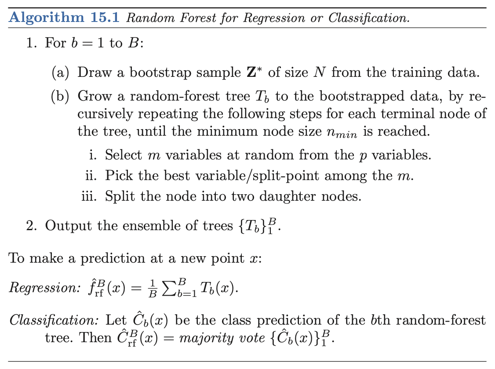

```{r, include=FALSE, message=FALSE, warning=FALSE, eval=FALSE}
set.seed(123) # reproducibility
library(ggplot2)
library(tidymodels)
library(tidyverse)
library(rpart)
library(randomForest)
library(reticulate)
library(GGally)

housing_training <- read_csv(file="./data/housing_training.csv")
housing_testing  <- read_csv(file="./data/housing_testing.csv")
adults_training <- read_csv(file="./data/adults_training.csv")
adults_testing  <- read_csv(file="./data/adults_testing.csv")
housing <- dplyr::union(housing_training, housing_testing)
```


```{python, include=FALSE, eval=FALSE}
import pandas as pd
from sklearn.model_selection import train_test_split
from sklearn.ensemble import RandomForestRegressor
from sklearn.ensemble import RandomForestClassifier
from sklearn.metrics import mean_squared_error, accuracy_score, classification_report, confusion_matrix
from sklearn.model_selection import GridSearchCV

housing_training = pd.read_csv("./data/housing_training.csv")
housing_testing  = pd.read_csv("./data/housing_testing.csv")
adults_training = pd.read_csv("./data/adults_training.csv")
adults_testing  = pd.read_csv("./data/adults_testing.csv")
```

\newpage

## Introduction

In this project, we will compare the R randomForest and Python sci-kit learn implementations of the random forest algorithm. We will fit a regression and classification model using both libraries and compare their performance and various metrics of speed and prediction accuracy.

\newpage

## Random Forest Algorithm

The random forest algorithm was created by Leo Breiman, and can be thought of as an improvement to the bagging algorithm [@Breiman2001]. One key difference between random forests and bagging is when each tree is grown, only a random subset of features are used at each terminal node to split the data. Whereas in bagging, the full set of features are used at each binary split. The purpose of this change is to decrease the correlation among the collection of trees. Below we present the random forest algorithm found in the Elements of Statistical Learning (Second Edition) on page 588 [@esl].

```{r boxplot, echo=FALSE, out.height="80%", out.width="80%", fig.align="center", fig.cap='Random Forest algorithm'}

```

Note: predictions are made by majority vote (classification) or by averaging the predicted value from each tree (regression).

\newpage
## Califonia Housing Dataset

The \textbf{California housing} dataset, found in section 10.14.1 of ESL, comes from the paper on "Sparse spatial autoregressions" [@KelleyPace1997]. There are $20,640$ observations, $8$ predictor variables and one response variable, median house value. A detailed description of each variable can be found below.

|                                 |                                    |
|:--------------------------------|:-----------------------------------|
| **Variable**                    | **Description**                    |
| median_income                   | median income of California block  |
| housing_median_age              | median age of the house            |
| total_rooms                     | aggregate total number of rooms    |
| total_bedrooms                  | aggregate total number of bedrooms |
| population                      | population of geographic block     |
| households                      | number of houses                   |
| latitude                        | latitude of geographic block       |
| longitude                       | longitude of geographic block      |
| median_house_value (response\*) | median house value                 |

We downloaded the California housing dataset from the Statlib website found [here](http://lib.stat.cmu.edu/datasets/). The Random Forest algorithm does not require feature scaling, so no data pre-processing is required.

```{r}

```

\newpage
## Adults Dataset

The \textbf{Adults} dataset comes from the UCI Machine Learning Repository [@UCI]. The dataset contains $45,170$ observations and $15$ features with information such as age, sex, hours of work per week which are used to classify whether an individual earns more than $50,000$ USD per year. The original dataset was sourced by Barry Becker from the US 1994 Census database. Further, a detailed description of each variable can be found below (description sourced from [@eren]).

|               |                                            |
|:-------------------------|:---------------------------------------------|
| **Variable**  | **Description**                               |
| age           | Peron's age                                      |
| workclass     | Occupation sector (ex. private, federal government)       |
| finalweight   | Estimate of population total where the individual is sourced from (i.e. similar observations should have similar weights based on Census data) |
| education     | Highest level of education attained (ex. bachelors)     |
| educationnum  | Years of education                            |
| maritalstatus | Marital status (ex. divorced, widowed)        |
| occupation    | Occupation title (ex. tech-support, farming-fishing)   |
| relationship  | Relationship status (ex. wife, unmarried)     |
| race          | Person's race (ex. white, asian-pac-islander)     |
| sex           | Male or Female                     |
| capitalgain   | Capital gains from the previous year       |
| capitalloss   | Capital losses from the previous year           |
| hoursperweek  | Number of hours worked per week  |
| nativecountry | Country person was born (ex. Ireland, Cuba)    |
| isGT50K (response\*) | $1$ if they earn more than $50,000$ USD per year and $0$ otherwise |
\newpage

```{r}

```

## randomForest Approach

First we create a random forest regression model using the California Housing dataset. The randomForest package can be used as the engine, so we will do it this way to make it easier to setup a tuning grid.

Due to computing constraints, a small grid of values have been selected to make the algorithm comparisons.

We adjust the above code and set the mode to classification, this time using the Adults dataset.

<!-- We find that mtry = 4, trees = 500 and min_n = 10 are the best hyperparameters for the random forest model. -->


\newpage
## Scikit Learn Approach

There are slight variations between the R and Python implementations, so we have tried to make them as similar as possible so a valid comparison can be made. We use the Scikit Learn library implementation of random forest to fit the regression and classification model [@scikit-learn].

The randomforestclassifier did not accept the original dataset with strings, so it was converted using pandas to a set of dummy variables first using help from [here](https://stackoverflow.com/questions/30384995/randomforestclassfier-fit-valueerror-could-not-convert-string-to-float).

\tiny
```{python, eval=FALSE}
import pandas as pd
from sklearn.ensemble import RandomForestRegressor
from sklearn.metrics import mean_squared_error
import time
import pickle
from sklearn.model_selection import GridSearchCV, RandomizedSearchCV

housing_train = housing_training.drop('median_house_value', axis=1)  # input features
y_train = housing_training['median_house_value']  # target variable
housing_test =  housing_testing.drop('median_house_value', axis=1)  # input features
y_test =  housing_testing['median_house_value']  # target variable

# defaults for python
rf_regression = RandomForestRegressor(random_state=1)
rf_regression.fit(housing_train, y_train)
y_pred = rf_regression.predict(housing_test)
mse = mean_squared_error(y_test, y_pred)
rmse = np.sqrt(mse)
print("RMSE:", rmse) # RMSE: 48703.06229688119

# using default parameters of randomForest
rf_regression_default = RandomForestRegressor(max_features=3, random_state=1)
rf_regression_default.fit(housing_train, y_train)
y_pred_default = rf_regression_default.predict(housing_test)
mse_default = mean_squared_error(y_test, y_pred_default)
rmse_default = np.sqrt(mse_default)
print("RMSE:", rmse_default) # RMSE: 49397.928321747604

# using hypertuned parameters from below
rf_regression_opt = RandomForestRegressor(max_features=5, min_samples_leaf=10, n_estimators=500, random_state=1)
rf_regression_opt.fit(housing_train, y_train)
y_pred_opt = rf_regression_opt.predict(housing_test)
pickle.dump(rf_regression__opt, open("python_regression.pkl", "wb"), protocol = 2)
mse_opt = mean_squared_error(y_test, y_pred_opt)
rmse_opt = np.sqrt(mse_opt)
print("RMSE:", rmse_opt) # RMSE: 50925.63753101504

# evaluate the speed of code
times_regression = []

for i in range(25):
  start_regression = time.time()
  rf_regression.fit(housing_train, y_train)
  end_regression = time.time()
  times_regression.append(end_regression - start_regression)

python_regression_times = pd.DataFrame(times_regression)
python_regression_times.to_csv("./metrics/python_regression_times.csv")


# tune the model
param_grid = { 
    'n_estimators': [200,300,400,500],
    'max_features' : [2,3,4,5]
}

# tuning the min_samples gave a worse answer, adjusting only certain param now
cv_rf_regression = GridSearchCV(estimator=rf_regression, param_grid=param_grid, cv=10)
cv_rf_regression.fit(housing_train, y_train)
cv_rf_regression.best_params_ #{'max_features': 5, 'min_samples_leaf': 10, 'n_estimators': 300}
```
\normalsize

Similarly we apply the above approach to classification.

\tiny
```{python, eval=FALSE}
import pandas as pd
from sklearn.ensemble import RandomForestClassifier
from sklearn.metrics import accuracy_score, confusion_matrix
import time
import pickle

adults_train = adults_training.drop('isGT50K', axis=1)  # input features
adults_train = pd.get_dummies(adults_train)
y_train = adults_training['isGT50K']  # target variable
adults_test =  adults_testing.drop('isGT50K', axis=1)  # input features
adults_test = pd.get_dummies(adults_test)
y_test =  adults_testing['isGT50K']  # target variable

# defaults for python
rf_classification = RandomForestClassifier(random_state=1)
rf_classification.fit(adults_train, y_train)
y_pred = rf_classification.predict(adults_test)
accuracy = accuracy_score(y_test, y_pred)
print("Accuracy:", accuracy) # Accuracy: 0.8578765607013193
print(confusion_matrix(y_pred, y_test))

# defaults for randomForest
rf_classification_default = RandomForestClassifier(max_features=3, random_state=1)
rf_classification_default.fit(adults_train, y_train)
y_pred_default = rf_classification_default.predict(adults_test)
pickle.dump(rf_classification_default, open("python_classification.pkl", "wb"), protocol = 2)
accuracy_default = accuracy_score(y_test, y_pred_default)
print("Accuracy:", accuracy_default) # Accuracy: 0.8522978836447357
print(confusion_matrix(y_pred_default, y_test))

# using hypertuned parameters from below
rf_classification_opt = RandomForestClassifier(max_features=5, n_estimators=200, random_state=1)
rf_classification_opt.fit(adults_train, y_train)
y_pred_opt = rf_classification_opt.predict(adults_test)
accuracy_opt = accuracy_score(y_test, y_pred_opt)
print("Accuracy:", accuracy_opt) # Accuracy: 0.8546887452404144
print(confusion_matrix(y_pred_opt, y_test))

# evaluate the speed of code
times_classification = []

for i in range(25):
  start_classification = time.time()
  rf_classification.fit(adults_train, y_train)
  end_classification = time.time()
  times_classification.append(end_classification - start_classification)
  
python_classification_times = pd.DataFrame(times_classification)
python_classification_times.to_csv("./metrics/python_classification_times.csv")


# tune the model
param_grid = {
    'n_estimators': [200,300,400,500],
    'max_features' : [2,3,4,5]
}

# tuning the min_samples gave a worse answer, adjusting only certain param now
cv_rf_classification = GridSearchCV(estimator=rf_classification, param_grid=param_grid, cv=10)
cv_rf_classification.fit(adults_train, y_train)
cv_rf_classification.best_params_ #{'max_features': 5, 'min_samples_leaf': 10, 'n_estimators': 300}
```
\normalsize

\newpage
## Fitted Model Comparisons

Using the same default settings, randomForest had an accuracy of $86.62\%$ compared to $85.23\%$ for sci-kit learn for classification. For regression, sci-kit learn had a RMSE of $49397.93$ compared to $50829.69$ for randomForest.

Further, sci-kit learn was significantly faster than the R implementation.

\newpage
## Conclusions

From the comparisons, we see that the Python implementation is generally faster compared to the R approach. There are some potential pitfalls in this analysis that cause the outputted times to vary, this could be due to lack of parallelization, variation in internals of each algorithm and hyperparameter variation. We have tried to reduce the last piece by tuning both in R and Python first, then creating a final model that uses the same hyperparameter values.

The out-of-bag error plots demonstrate the two approaches to be quite similar. Further, the predictions on the validation sets for both classification and regression appear to be similar up to a high order of floating point approximation.

In conclusion, the choice between Python or R comes down to user preference.

\newpage
## References

