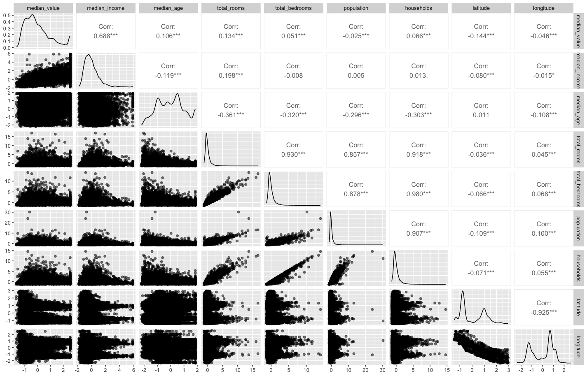
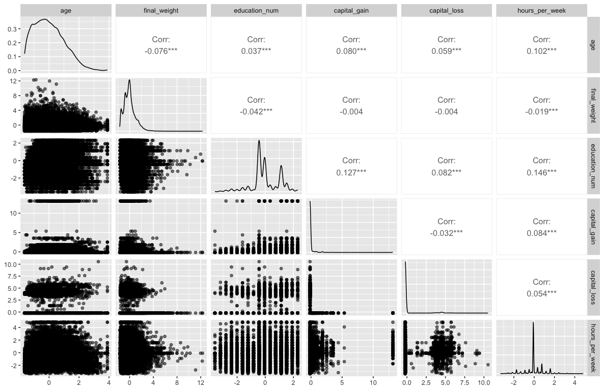
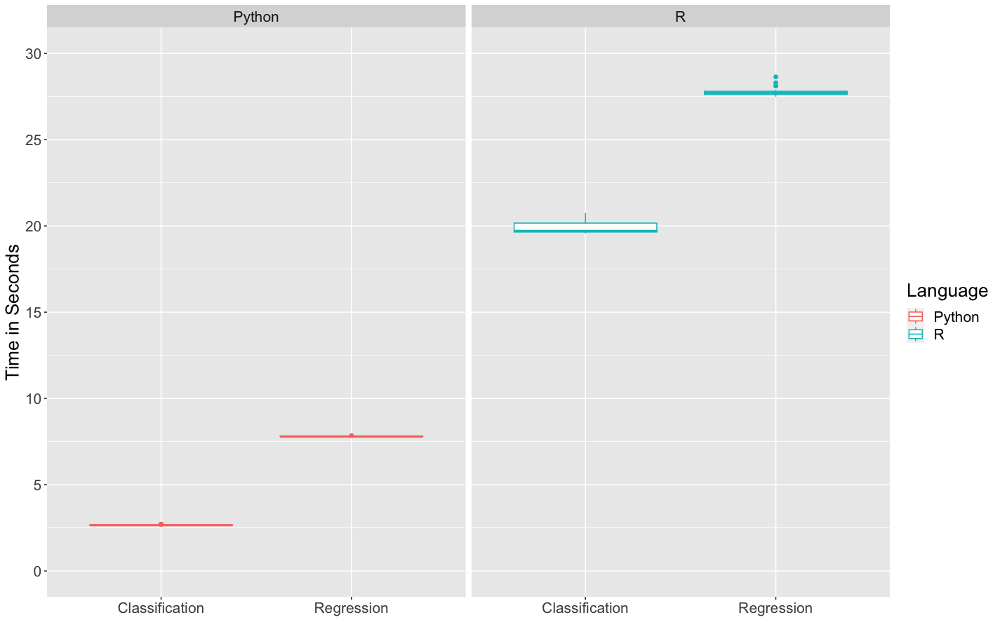
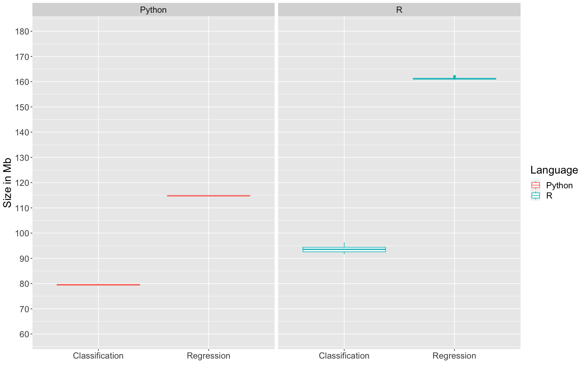
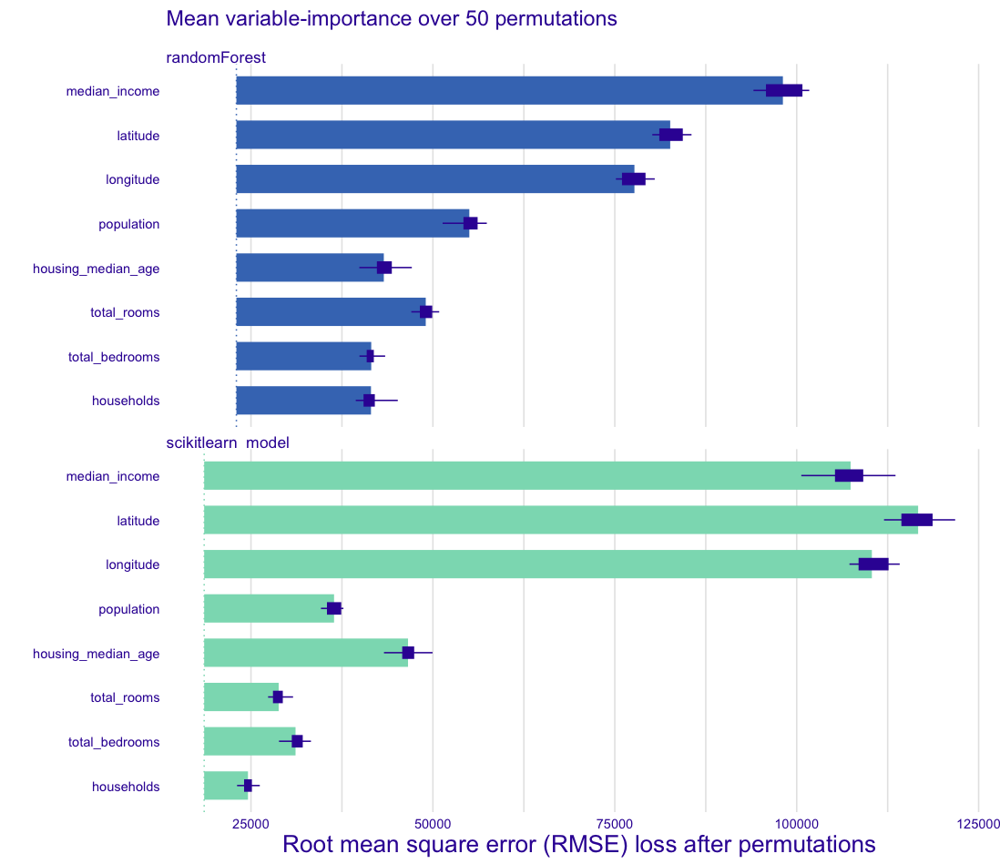

```{r, include=FALSE, message=FALSE, warning=FALSE, eval=FALSE}
set.seed(1) # reproducibility
library(ggplot2)
library(tidymodels)
library(tidyverse)
library(rpart)
library(randomForest)
library(reticulate)
library(GGally)
library(vip)
library(DALEXtra)
library(lobstr)

housing_training <- read_csv(file="./data/housing_training.csv")
housing_testing  <- read_csv(file="./data/housing_testing.csv")
adults_training <- read_csv(file="./data/adults_training.csv")
adults_testing  <- read_csv(file="./data/adults_testing.csv")
housing <- dplyr::union(housing_training, housing_testing)
```

```{python, include=FALSE, eval=FALSE}
import pandas as pd
import numpy as np
from sklearn.ensemble import RandomForestRegressor, RandomForestClassifier
from sklearn.metrics import mean_squared_error, accuracy_score, confusion_matrix
import time
import pickle
from sklearn.model_selection import GridSearchCV
import sys

housing_training = pd.read_csv("./data/housing_training.csv")
housing_testing  = pd.read_csv("./data/housing_testing.csv")
adults_training = pd.read_csv("./data/adults_training.csv")
adults_testing  = pd.read_csv("./data/adults_testing.csv")
```

\newpage

## Introduction

In this project, we will compare the R randomForest and Python sci-kit learn implementations of the random forest algorithm. We will fit a regression and classification model using both libraries and compare their performance and various metrics of speed and prediction accuracy.

## Random Forest Algorithm

The random forest algorithm was introduced by Leo Breiman in a 2001 paper titled "Random Forests" [@Breiman2001]. Similar to bagging, the random forest algorithm is a tree ensemble method that can applied to regression and classification problems. A key difference between random forests and bagging is how each tree is grown. In bagging, the full set of features are used whereas in random forests, a random subset of features are used at each terminal node to grow the tree. The main purpose of this change is to decrease the correlation present among the forest of trees. Below we show the random forest algorithm found in the Elements of Statistical Learning (Second Edition) on page 588 [@esl].

```{r, echo=FALSE, out.height="80%", out.width="80%", fig.align="center", fig.cap='Random Forest algorithm'}
knitr::include_graphics("pictures/rf_algo.png")
```

\newpage

## Califonia Housing Dataset

The \textbf{California housing} dataset, found in section 10.14.1 of ESL, comes from the paper on "Sparse spatial autoregressions" [@KelleyPace1997]. There are $20,640$ observations, $8$ predictor variables and one response variable, median house value. We downloaded the California housing dataset from the Statlib website found [here](http://lib.stat.cmu.edu/datasets/). A detailed description of each variable can be found below.

\

|                                 |                                    |
|:--------------------------------|:-----------------------------------|
| **Variable**                    | **Description**                    |
| median_income                   | median income of California block  |
| housing_median_age              | median age of the house            |
| total_rooms                     | aggregate total number of rooms    |
| total_bedrooms                  | aggregate total number of bedrooms |
| population                      | population of geographic block     |
| households                      | number of houses                   |
| latitude                        | latitude of geographic block       |
| longitude                       | longitude of geographic block      |
| median_house_value (response\*) | median house value                 |

\newpage

From the following pairs plot, we see high correlations among certain features like total rooms/total bedrooms and population/households. One reason could be that areas with more households naturally have higher populations and houses with more bedrooms naturally have more rooms.

\

```{r, echo=FALSE, out.height="100%", out.width="100%", fig.align="center", fig.cap='Pairs plot of continous features'}

```

\newpage

## Adults Dataset

The \textbf{Adults} dataset comes from the UCI Machine Learning Repository [@UCI]. There are $45,170$ observations and $15$ features in the dataset with information such as age, sex, hours of work per week which are used to classify whether an individual earns more than $50,000$ USD per year. The data was sourced by Barry Becker from the 1994 US Census database. Further, a detailed description of each variable can be found below (description sourced from [@eren]).

\

|                      |                                                                                                                                                |
|:-------------------------|:---------------------------------------------|
| **Variable**         | **Description**                                                                                                                                |
| age                  | Peron's age                                                                                                                                    |
| workclass            | Occupation sector (ex. private, federal government)                                                                                            |
| finalweight          | Estimate of population total where the individual is sourced from (i.e. similar observations should have similar weights based on Census data) |
| education            | Highest level of education attained (ex. bachelors)                                                                                            |
| educationnum         | Years of education                                                                                                                             |
| maritalstatus        | Marital status (ex. divorced, widowed)                                                                                                         |
| occupation           | Occupation title (ex. tech-support, farming-fishing)                                                                                           |
| relationship         | Relationship status (ex. wife, unmarried)                                                                                                      |
| race                 | Person's race (ex. white, asian-pac-islander)                                                                                                  |
| sex                  | Male or Female                                                                                                                                 |
| capitalgain          | Capital gains from the previous year                                                                                                           |
| capitalloss          | Capital losses from the previous year                                                                                                          |
| hoursperweek         | Number of hours worked per week                                                                                                                |
| nativecountry        | Country person was born (ex. Ireland, Cuba)                                                                                                    |
| isGT50K (response\*) | $1$ if they earn more than $50,000$ USD per year and $0$ otherwise                                                                             |

\newpage

From the following pairs plot, we see the continuous features are mostly uncorrelated. Surprisingly, age and hours of work per week are only weakly correlated. It would make sense that senior employees work longer hours than junior employees but the data suggest this may not hold. Further, years of education and capital gains are only weakly correlated as well, indicating that more educated people do not necessarily make better financial decisions (ex. in stock trading).

\

```{r, echo=FALSE, out.height="95%", out.width="95%", fig.align="center", fig.cap='Pairs plot of continous features'}

```

\newpage

## Using Python and Scikit Learn

We use the scikit learn library to implement the random forest algorithm for a regression and classification problem [@scikit-learn]. Using the California Housing and Adults datasets, we fit the models below and display the code used to fit and generate predictions for each model. The code to generate the models was aided by the user guide for random forests available on the scikit learn website.

\

\tiny

```{python, eval=FALSE}
housing_training = pd.read_csv("./data/housing_training.csv")
housing_testing  = pd.read_csv("./data/housing_testing.csv")

housing_train = housing_training.drop('median_house_value', axis=1)  # input features
y_train = housing_training['median_house_value']  # target variable
housing_test =  housing_testing.drop('median_house_value', axis=1)  # input features
y_test =  housing_testing['median_house_value']  # target variable

# defaults for python
rf_regression = RandomForestRegressor(random_state=1)
rf_regression.fit(housing_train, y_train)
pickle.dump(rf_regression, open("python_regression.pkl", "wb"), protocol = 2)
y_pred = rf_regression.predict(housing_test)
mse = mean_squared_error(y_test, y_pred)
rmse = np.sqrt(mse)
print("RMSE:", rmse) # RMSE: 48703.06229688119

# using default parameters of randomForest
rf_regression_default = RandomForestRegressor(max_features=3, random_state=1)
rf_regression_default.fit(housing_train, y_train)
y_pred_default = rf_regression_default.predict(housing_test)
mse_default = mean_squared_error(y_test, y_pred_default)
rmse_default = np.sqrt(mse_default)
print("RMSE:", rmse_default) # RMSE: 49397.928321747604

# using hypertuned parameters from below
rf_regression_opt = RandomForestRegressor(max_features=5, min_samples_leaf=10, n_estimators=500, random_state=1)
rf_regression_opt.fit(housing_train, y_train)
y_pred_opt = rf_regression_opt.predict(housing_test)
mse_opt = mean_squared_error(y_test, y_pred_opt)
rmse_opt = np.sqrt(mse_opt)
print("RMSE:", rmse_opt) # RMSE: 50925.63753101504

# evaluate the speed of code
times_regression = []
size_regression = []

rf_regression = RandomForestRegressor()

for i in range(25):
  start_regression = time.time()
  rf_regression.fit(housing_train, y_train)
  end_regression = time.time()
  times_regression.append(end_regression - start_regression)
  t = pickle.dumps(rf_regression)
  size_regression.append(sys.getsizeof(t)) # sizes all the same
  
python_regression_times = pd.DataFrame(list(zip(times_regression, size_regression)))
python_regression_times.columns =['times', 'size']
python_regression_times.to_csv("./metrics/python_regression_times.csv")

# tune the rf model
param_grid = {
    'n_estimators': [200,300,400,500],
    'max_features' : [2,3,4,5],
    'min_samples_leaf' : [10,20,30]
}

# tuning the min_samples gave a worse answer, adjusting only certain param now
cv_rf_regression = GridSearchCV(estimator=rf_regression, param_grid=param_grid, cv=10)
cv_rf_regression.fit(housing_train, y_train)
cv_rf_regression.best_params_ #{'max_features': 5, 'min_samples_leaf': 10, 'n_estimators': 300}
```

\normalsize

\

Similarly we apply the above approach to classification with the Adults dataset. Further, we note the RandomForestClassifier function requires categorical variables to be one-hot encoded, so we use pandas to make a set of dummy variables using the pd.get_dummies function (taken from [here](https://stackoverflow.com/questions/30384995/randomforestclassfier-fit-valueerror-could-not-convert-string-to-float)).

\

\tiny

```{python, eval=FALSE}
adults_training = pd.read_csv("./data/adults_training.csv")
adults_testing  = pd.read_csv("./data/adults_testing.csv")

adults_train = adults_training.drop('isGT50K', axis=1)  # input features
adults_train = pd.get_dummies(adults_train)
y_train = adults_training['isGT50K']  # target variable
adults_test =  adults_testing.drop('isGT50K', axis=1)  # input features
adults_test = pd.get_dummies(adults_test)
y_test =  adults_testing['isGT50K']  # target variable

# for later
adults_train.to_csv("adults_training_dummies.csv")
adults_test.to_csv("adults_testing_dummies.csv")

# defaults for python
rf_classification = RandomForestClassifier(random_state=1)
rf_classification.fit(adults_train, y_train)
y_pred = rf_classification.predict(adults_test)
accuracy = accuracy_score(y_test, y_pred)
print("Accuracy:", accuracy) # Accuracy: 0.8578765607013193
print(confusion_matrix(y_pred, y_test))

# defaults for randomForest with max_features = 3
rf_classification_default = RandomForestClassifier(max_features=3, random_state=1)
rf_classification_default.fit(adults_train, y_train)
y_pred_default = rf_classification_default.predict(adults_test)
pickle.dump(rf_classification_default, open("python_classification.pkl", "wb"), protocol = 2)
accuracy_default = accuracy_score(y_test, y_pred_default)
print("Accuracy:", accuracy_default) # Accuracy: 0.8522978836447357
print(confusion_matrix(y_pred_default, y_test))

# using hypertuned parameters from below
rf_classification_opt = RandomForestClassifier(max_features=5, n_estimators=200, random_state=1)
rf_classification_opt.fit(adults_train, y_train)
y_pred_opt = rf_classification_opt.predict(adults_test)
accuracy_opt = accuracy_score(y_test, y_pred_opt)
print("Accuracy:", accuracy_opt) # Accuracy: 0.8546887452404144
print(confusion_matrix(y_pred_opt, y_test))

# evaluate the speed of code
times_classification = []
size_classification = []

rf_classification = RandomForestClassifier()

for i in range(25):
  start_classification = time.time()
  rf_classification.fit(adults_train, y_train)
  end_classification = time.time()
  times_classification.append(end_classification - start_classification)
  t = pickle.dumps(rf_classification)
  size_classification.append(sys.getsizeof(t))
  
python_classification_times = pd.DataFrame(list(zip(times_classification, size_classification)))
python_classification_times.columns =['times', 'size']
python_classification_times.to_csv("./metrics/python_classification_times.csv")

# tune the rf model
param_grid = {
    'n_estimators': [200,300,400,500],
    'max_features' : [2,3,4,5],
    'min_samples_leaf' : [10,20,30]
}

# tuning the min_samples gave a worse answer, adjusting only certain param now
cv_rf_classification = GridSearchCV(estimator=rf_classification, param_grid=param_grid, cv=10)
cv_rf_classification.fit(adults_train, y_train)
cv_rf_classification.best_params_ #{'max_features': 5, 'min_samples_leaf': 10, 'n_estimators': 300}
```

\normalsize

\newpage
## Using R and randomForest

We use the randomForest library in R to implement the random forest algorithm for a regression and classification problem [@randomForest]. Using the California Housing and Adults datasets, we fit the models below and display the code used to fit and generate predictions for each model.

\

\tiny
```{r, eval=FALSE}
housing_training <- read_csv(file="./data/housing_training.csv")
housing_testing  <- read_csv(file="./data/housing_testing.csv")

# using R defaults
rf_regression <- randomForest(median_house_value ~ ., data=housing_training)
rf_pred <- predict(rf_regression, newdata=housing_testing)
rmse <- sqrt(sum((rf_pred - housing_testing$median_house_value)^2)/length(rf_pred))
paste("RMSE:", rmse) # RMSE: 50719.3875768653
plot(rf_regression)

# using default parameters of scikit learn
rf_regression_default <- randomForest(median_house_value ~ ., data=housing_training, ntrees=100)
rf_pred_default <- predict(rf_regression_default, newdata=housing_testing)
rmse_default <- sqrt(sum((rf_pred_default - housing_testing$median_house_value)^2)/length(rf_pred_default))
paste("RMSE:", rmse_default) # RMSE: 50974.7547537137
plot(rf_regression_default)

# using hypertuned parameters from Python
rf_regression_opt <- randomForest(median_house_value ~ ., data=housing_training, ntrees=500, mtry=5, nodesize=10)
rf_pred_opt <- predict(rf_regression_opt, newdata=housing_testing)
rmse_default <- sqrt(sum((rf_pred_opt - housing_testing$median_house_value)^2)/length(rf_pred_opt))
paste("RMSE:", rmse_default) # RMSE: 48336.0260963631
plot(rf_regression_opt)

# regression timings for randomForest
times_regression <- vector(mode="double", length=25L)
size_regression <- vector(mode="double", length=25L)
for (i in 1:25) {
  start_regression <- Sys.time()
  t <- randomForest(median_house_value ~ ., data=housing_training, ntrees=100)
  end_regression <- Sys.time()
  times_regression[i] <- end_regression - start_regression
  size_regression[i] <- lobstr::obj_size(t)
  rm(t)
}

r_regression_times <- tibble(times=times_regression, size=size_regression)
write_csv(r_regression_times, "./metrics/r_regression_times.csv")

# get model to explain specific example from validation set
python_explainer_regression <- explain_scikitlearn("python_regression.pkl",
                                                   data=housing_training[-1],
                                                   y=housing_training$median_house_value)

r_explainer_regression <- explain_tidymodels(rf_regression_opt,
                                             data=housing_training[-1],
                                             y=housing_training$median_house_value)

python_shap_boost <- predict_parts(explainer=python_explainer_regression,
                                   new_observation=housing_testing[1,-1],
                                   type="shap",
                                   B=50)

r_shap_boost <- predict_parts(explainer=r_explainer_regression,
                              new_observation=housing_testing[1,-1],
                              type="shap",
                              B=50)

# variable importance plots
python_vip_boost <- model_parts(python_explainer_regression)
r_vip_boost <- model_parts(r_explainer_regression)
plot(r_vip_boost, python_vip_boost) +
  ggtitle("Mean variable-importance over 50 permutations", "")
```
\normalsize

\

Similarly we apply the above approach to classification with the Adults dataset. Unlike scikit learn, randomForest handles categorical data without requiring any data pre-processing, and infers the type of problem based on the target variable being a factor.

\

\tiny

```{r, eval=FALSE}
set.seed(1) ## reproducibility
# adults <- read_csv(file="./data/adults.csv")
# adults$isGT50K <- factor(adults$isGT50K)
# adults_splits <- initial_split(adults)
# adults_training <- training(adults_splits)
# adults_testing  <- testing(adults_splits)

adults_training <- read_csv(file="./data/adults_training.csv")
adults_testing  <- read_csv(file="./data/adults_testing.csv")
adults_training$isGT50K <- factor(adults_training$isGT50K)
adults_testing$isGT50K <- factor(adults_testing$isGT50K)

# using R defaults
rf_classification <- randomForest(isGT50K ~ ., data=adults_training)
rf_pred <- predict(rf_classification, newdata=adults_testing)
accuracy <- sum(rf_pred == adults_testing$isGT50K)/length(rf_pred)
paste("Accuracy:", accuracy) # Accuracy: 0.865668998494643
plot(rf_classification)

# using default parameters of scikit learn
rf_classification_default <- randomForest(isGT50K ~ ., data=adults_training, ntrees=100)
rf_pred_default <- predict(rf_classification_default, newdata=adults_testing)
accuracy_default <- sum(rf_pred_default == adults_testing$isGT50K)/length(rf_pred_default)
paste("Accuracy:", accuracy_default) # Accuracy: 0.864606393341008
plot(rf_classification_default)

# using hypertuned parameters from Python
rf_classification_opt <- randomForest(isGT50K ~ ., data=adults_training, ntrees=200, mtry=5)
rf_pred_opt <- predict(rf_classification_opt, newdata=adults_testing)
accuracy_opt <- sum(rf_pred_opt == adults_testing$isGT50K)/length(rf_pred_opt)
paste("Accuracy:", accuracy_opt) # Accuracy: 0.863366687328434
plot(rf_classification_opt)

# classification timings for randomForest
times_classification <- vector(mode="double", length=25L)
size_classification <- vector(mode="double", length=25L)
for (i in 1:25) {
  start_classification <- Sys.time()
  t <- randomForest(isGT50K ~ ., data=adults_training, ntrees=100)
  end_classification <- Sys.time()
  times_classification[i] <- end_classification - start_classification
  size_classification[i] <- lobstr::obj_size(t)
  rm(t)
}

r_classification_times <- tibble(times=times_classification, size=size_classification)
write_csv(r_classification_times, "./metrics/r_classification_times.csv")
```

\normalsize


\newpage

## Model Fit Comparisons

We fit six models in total - three for regression and three for classification using the California Housing and Adults datasets respectively. The first model we fit used the default randomForest and scikit learn implementations. The second model we fit matched the `n_trees` argument in randomForest to the `n_estimators` default in scikit learn (as this is the only difference between the two implementations). The third model was fit using parameters generated using grid search in Python (grid search not completed in R due to computing time). 

Below we display the best models for regression and classification using RMSE and accuracy respectively. We see that the R models tend to perform better than the Python models on prediction, having better overall RMSE and accuracy scores. Further, we found that the default model parameters for randomForest and scikit learn tended to outperform the tuned grid search models.

\

| Language |   Package    |    Problem     | Tuned Model? |  Metric  |  Score   |
|:--------:|:------------:|:--------------:|:------------:|:--------:|:--------:|
|    R     | randomForest |   Regression   |     Yes      |   RSME   | 48336.03 |
|  Python  | scikit learn |   Regression   |      No      |   RSME   | 48703.06 |
|    R     | randomForest | Classification |      No      | Accuracy |  86.57%  |
|  Python  | scikit learn | Classification |      No      | Accuracy |  85.80%  |

\

From the first chart below, we see Python was about $8$ times faster for regression and $3.5$ times faster for classification compared to R. From the second chart, we see the fitted model object size in Python was on average $71.43 \%$ smaller for regression and $84.94 \%$ smaller for classification compared to R. Based on these plots, we can conclude that Python implementation is generally faster and more memory efficient than the R implementation.

```{r, echo=FALSE, out.height="85%", out.width="85%", fig.align="center", fig.cap='Time to fit random forest models in Python and R'}

```

```{r, echo=FALSE, out.height="85%", out.width="85%", fig.align="center", fig.cap='Object size in Mb of random forest models in Python and R'}

```

\newpage

Below we plot the variable importance for the best Python and R regression models. We see both models have median income, latitude and longitude as the most important predictors of median house value in California. Further, the scikit learn model places more weight on these variables compared to the other features, whereas the randomForest model seems to more evenly weigh the variables in terms importance. Both models achieve similar RMSE as reported above, but differ slightly in the weight associated to each variable.

\

```{r, echo=FALSE, out.height="100%", out.width="100%", fig.align="center", fig.cap='Variable importance plot for best regression models in Python and R'}

```

\

Due to some graphical issues, we omit the variable importance plot for the best classification models in Python and R.

\newpage
## Conclusions

The random forest algorithm is a popular tree based ensemble technique that can be used for regression and classification problems. We chose to compare a popular Python and R implementation of the random forest algorithm as they are currently the most used languages in data science. We found that on average, the Python implementation tends to be faster than R but yields slightly lower prediction accuracy. 

Practically speaking, the slight loss in prediction accuracy is worth the reduction in computing time that Python's scikit learn provides. However, given the integration between R and Python using packages like reticulate, it is possible to benefit from R's extensive graphical libraries as well as the speed of Python for any data science analysis.

\newpage
## References
